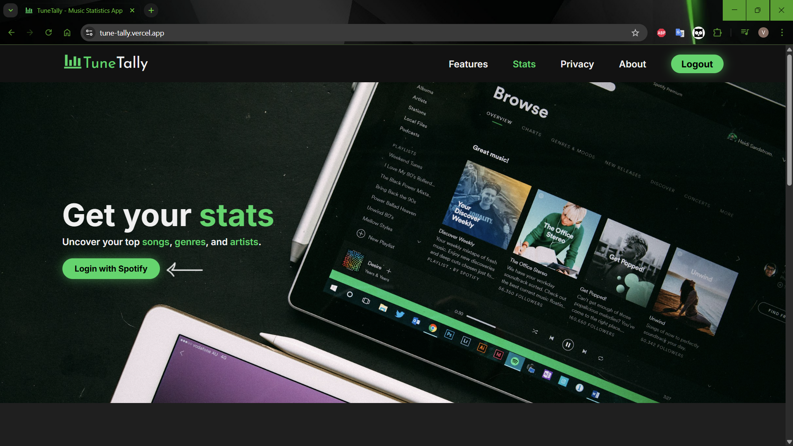
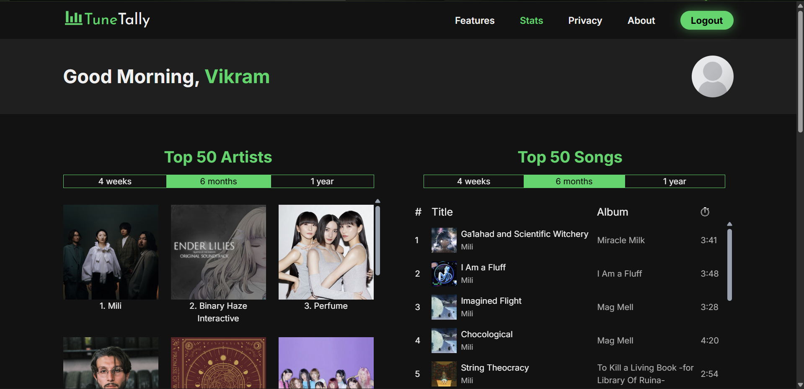
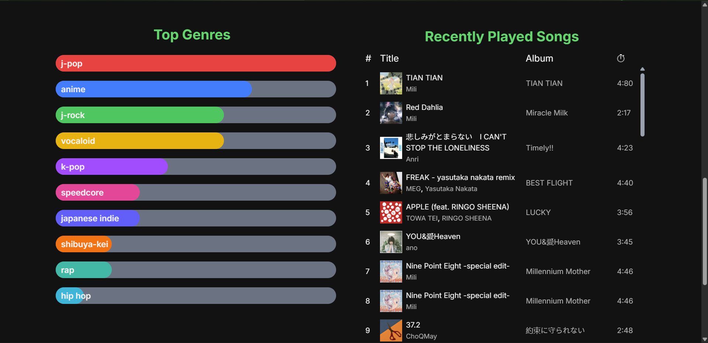

# TuneTally  
_Your personalized music listening stats, powered by serverless AWS and React._
<br />

[**TuneTally**](https://tune-tally.vercel.app) is a music listening statistics app

Check out your **top artists, top songs, favorite genres, and recently played tracks** - all in one clean, minimal interface.

Although currently connected only to Spotify, the app is designed with a platform-agnostic architecture and scalability in mind.

## ✨ Features
- 🎤 View your **Top Artists** and **Top Songs**
- 📊 Discover your **Top Genres**
- 🎧 See your **Recently Played Tracks**
- 🔒 Secure server-side sessions with HttpOnly cookies
- 🕒 Sessions auto-expire after 1 hour for privacy

## 📸 Screenshots
### Homepage


### Top Artists & Songs


### Top Genres & Recently Played


## 🚀 Tech Stack
- **Frontend**: React (TypeScript + React Query + React Router) + Vite + Tailwind CSS 
- **Backend**: Serverless AWS Lambda (Python)
- **Database**: AWS DynamoDB 
- **Infrastructure**: Terraform + API Gateway  
- **Authentication**: OAuth 2.0 (Authorization Code flow) with Server Side Sessions using secure HttpOnly cookies 
- **Hosting**: Vercel (frontend), AWS (backend) 

We use Backend-for-Frontend (BFF) pattern through lambda functions to make the app music platform agnostic.  
Built with inherent scalability through AWS Lambdas


## ⚙️ How It Works
1. User logs in with Spotify (Authorization Code flow).  
2. AWS Authorization Lambda securely exchanges tokens and generates a **UUID session**.  
3. Session ID is set as an **HttpOnly, Secure cookie**.  
4. Frontend requests data from the Request Proxy Lambda using the session. This serves as a secure intermediary for auth token handling, data requesting and caching
5. Data is cached in memory for 1 hour (no permanent storage) or until the user presses the logout button. 

## 📝 Note (Spotify API Policy Change, May 2025)
On **May 15, 2025**, Spotify restricted access to its API. Only registered business organizations with over 250,000 monthly active users can use the API to access data for all accounts. Other users can still use the API in development mode for manually whitelisted accounts.

As a result:  

- The app is currently in **demo mode**.  
- Visitors can explore stats using a **permanently logged-in demo user** account.  
- The app remains fully presentable, but **personal Spotify logins are restricted**.  

On click of the login button, the app fetches demo user's data and uses demo user's refresh tokens to get a new auth token if the old one is expired.

**P.S:** - If you’d like to use your own Spotify account with TuneTally, email me your **full name** and **email address** for your Spotify account with the title "TUNENTALLY - SUPER DUPER IMPORTANT". I can then add you as a whitelisted user in the Spotify Developer Dashboard, enabling a special login option.  

## 🛠️ Development Setup 
### For Production version
1. Clone the repo
   ```bash
   git clone https://github.com/vikram42003/TuneTally.git
   ```
2. Install dependencies  
   ```bash
   npm install
   ```
3. The app requires the following environment variables to function  
   `./.env`
   ```
   VITE_LAMBDA_SPOTIFY_BASE_URL=<the base url for requestProxyLambda>
   ```

   `./Terraform/.env`
   ```
   export TF_VAR_SPOTIFY_CLIENT_ID=<your spotify api client id>
   export TF_VAR_SPOTIFY_CLIENT_SECRET=<your spotify api client secret>
   export TF_VAR_SPOTIFY_REDIRECT_URI=<the base url for authorizationLambda + /spotifyLoginCallback>
   export TF_VAR_TUNETALLY_BASE_URL=<the app url>
   ```
5. Install requests package as a lambda layer for AWS Lambdas to use
   ```
   pip install requests -t ./Terraform/python/lambda_layer_source/python/
   ```
4. Source the .env file and provision Infrastructure with terraform  
   Note - Make sure Terraform is installed and configured correctly. Checkout [this](https://developer.hashicorp.com/terraform/tutorials/configuration-language/configure-providers?utm_source=chatgpt.com) or [this](https://registry.terraform.io/providers/hashicorp/aws/latest/docs) for help with setup
   ```bash
   cd Terraform
   source .env
   terraform apply
   ```
5. Start the local dev server. The app uses vite-plugin-mkcert (we need https for httpOnly cookie with Same-Site=None) and it will be hosted over https://localhost:5173 by default
   ```bash
   npm run dev
   ```
6. Build app for production
   ```bash
   npm run build
   ```
7. After build, you can preview locally
   ```bash
   npm run preview
   ```

### For Demo version
For the demo version, you need to do the following in addition to the aforementioned steps.
1. Add the following variable to `./.env`
   ```
   VITE_ENVIRONMENT="dev"
   ```
2. Uncomment the `if demo_mode == "login":` part in `./Terraform/python/authorizationLambda.py` and use the `loginWithSpotifyDEMO` function in `./src/api/auth/spotifyAuth/SpotifyAuth.ts` to manually add a spotify account to be used as a demo user
3. Change all login buttons to use `loginWithSpotifyRefreshTokenDEMO` function in `./src/api/auth/spotifyAuth/SpotifyAuth.ts` to login

The setup for the demo version is more involved, but it’s a one time process.

## 🔒 Privacy
- No permanent accounts or databases.  
- Session data auto-deletes after 1 hour.  
- Cookies use `HttpOnly` and `Secure`.